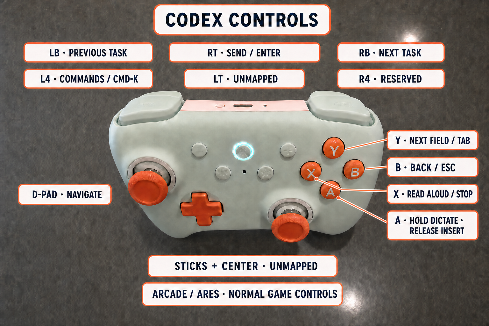

# Codex Gamepad

Codex Gamepad turns an 8BitDo Ultimate 2C into a focused controller for Codex Desktop on macOS. It adds controller navigation, dictation, send/cancel shortcuts, **speak last response**, and automatic handoff to supported games.

The v0.1 release is Apple Silicon only and requires macOS 15 or newer. Project code is MIT licensed. This is an unofficial community project and is not affiliated with OpenAI, Apple, Karabiner-Elements, 8BitDo, or Kokoro.

## Install with the setup app

1. Install [Karabiner-Elements 16 or newer](https://karabiner-elements.pqrs.org/), open it once, and approve the macOS system-extension and input permissions it requests.
2. Download the Apple Silicon setup bundle from [Releases](https://github.com/skysmith/codex-gamepad/releases).
3. Drag **Codex Gamepad Setup** to Applications and open it.
4. Select **Install**. The app creates the isolated runtime, installs the receiver, safely creates the paired Karabiner profiles, and enables the supported rule pair.
5. Connect the 8BitDo over Bluetooth LE, return to Setup, and confirm it shows as connected.

The same app remains installed as the control panel. Use it to repair/update the runtime, change controller bindings, choose an Apple voice, or install Kokoro later.

The controller does not need to be connected during software installation. Setup never asks for an administrator password itself; macOS and Karabiner own their native permission prompts.

### Opening the unnotarized beta

Current test bundles are clearly named `UNNOTARIZED-BETA`. Apple has not scanned them and macOS cannot verify their developer. Only continue when the bundle came from a trusted source and its published SHA-256 checksum matches.

1. Drag **Codex Gamepad Setup** to Applications, then double-click it once. macOS will probably block it; click **Done**.
2. Open **System Settings > Privacy & Security**, scroll to Security, and click **Open Anyway** for Codex Gamepad Setup.
3. Authenticate with your Mac login if requested, then click **Open** in the warning that reappears.
4. Read the included **READ ME FIRST** file for the complete beta installation notes.

The Open Anyway button is available for about one hour after the blocked launch attempt. Do not disable Gatekeeper or strip the app's quarantine attributes. A future Developer ID release will use the normal notarized first-launch flow.

## Controller bindings



| Input | Default action |
| --- | --- |
| D-pad | Arrow keys |
| A | Hold to dictate, release to insert for review (`Ctrl-Shift-D`) |
| B | Escape / cancel |
| X | Speak the last completed response; press again to stop |
| Y | Next field (`Tab`) |
| LB / RB | Previous / next task (`Cmd-Shift-[` / `Cmd-Shift-]`) |
| L4 | Command menu (`Cmd-K`) |
| R4 | Unmapped |
| RT | Return / send |

Every mapping can be reassigned in the **Controls** tab. The generated rules stay restricted to the hardware-verified Ultimate 2C IDs (`vendor_id` 11720, `product_id` 12315) and Codex (`com.openai.codex`). Unsupported foreground apps receive no mapped actions.

The button numbers and D-pad events were captured from a physical Ultimate 2C over Bluetooth LE. D-pad Up and an earlier speech binding have passed live end-to-end checks; the complete current binding pass remains documented in [the hardware checklist](docs/HARDWARE_TEST.md). Do not treat 2.4 GHz, wired mode, or another controller as supported until Karabiner EventViewer and the full functional pass confirm it.

## Voice choices

Apple's built-in system voices are the default. They require no model download and work fully offline during speech.

[Kokoro](https://huggingface.co/hexgrad/Kokoro-82M) is available in the Voice tab as an optional quality upgrade. It is intentionally not bundled: choosing **Install Kokoro** downloads the pinned Python packages and checksum-verified model files from their upstream projects. The model download is about 337 MB. No network is used while speaking.

Speech flow:

```text
controller
  -> scoped Karabiner user command
  -> local Swift receiver (rechecks frontmost app)
  -> codex-speak-last
  -> Codex app-server thread/list + thread/read
  -> final-answer selection and Markdown cleanup
  -> Apple speech over stdin, or optional Kokoro ONNX
```

Only the newest completed turn's `final_answer` is eligible. Plans, commentary, tool output, interrupted turns, in-progress output, and subagent replies are ignored. Response text never enters a shell command, process argument, log, notification, or persistent audio cache. Kokoro's temporary WAVs are mode 0600 and deleted immediately after playback.

### Task-selection limitation

Codex app-server exposes task recency but not the task currently visible in the window. Automatic mode therefore speaks the most recently prompted Desktop task. Merely navigating to an older task without sending a prompt does not change selection. Add a `thread` value to `~/.config/codex-gamepad/config.json` when an exact task must be pinned.

## Automatic game handoff

The receiver owns two guarded Karabiner profiles:

- **Codex Controller** captures only the verified controller. Its mappings still fire only with Codex frontmost.
- **Game Mode** releases that controller to the active game while preserving unrelated device settings.

Foreground detection currently supports the dedicated Codex Arcade Chrome profile, ares (`dev.ares.ares`), and The Living Forest's managed Luanti player. Leaving a game open in the background does not hold Game Mode. The receiver reconciles the profile at startup, app activation, Mac wake, and after temporary Karabiner failures.

## Source install and command-line checks

The setup app is the public install path. Contributors can still run the guarded source installer:

```sh
./scripts/install-local.sh --create-venv --enable-managed-rules
```

Add `--with-kokoro`, then run `./scripts/download-models.sh`, only when installing the optional backend. `--receiver-binary` and `--profile` are primarily used by the setup app.

Read-only preflight:

```sh
./scripts/preflight.sh
```

Metadata-only speech selection check:

```sh
codex-speak-last --dry-run
```

Foreground speech and controller-equivalent toggle:

```sh
codex-speak-last
codex-speak-last --background --toggle --require-frontmost
```

WAV output is available only with the optional Kokoro backend:

```sh
codex-speak-last --speech-backend kokoro --output /tmp/codex-response.wav
```

## Uninstall

The guarded uninstaller restores the previously selected Karabiner profile and removes only artifacts recorded in Codex Gamepad's ownership manifest:

```sh
"$HOME/.local/bin/codex-gamepad-uninstall"
```

Preferences and downloaded models are preserved for a safe reinstall. Add `--models` only when intentionally removing the model files too.

## Development

```sh
PYTHONPATH=src python3 -m unittest discover -s tests -v
swift test --package-path control-panel
swift build -c release --package-path receiver
receiver/.build/release/codex-gamepad-receiver --self-test
```

Build a local ad-hoc Apple Silicon release candidate:

```sh
scripts/build-setup-app.sh
```

The script puts the app and DMG in `dist/`. Without a Developer ID identity it also creates one shareable `UNNOTARIZED-BETA.zip` containing the DMG, its checksum, and first-launch instructions. It refuses to label or submit an ad-hoc build as notarized. See [the release runbook](docs/RELEASING.md) for beta packaging, Developer ID signing, Apple notarization, stapling, and GitHub release automation.

## License and dependencies

Project code is MIT licensed. See [THIRD_PARTY_NOTICES.md](THIRD_PARTY_NOTICES.md). The setup app bundles arm64 `uv`; it does not bundle Kokoro, its model, or its GPL phonemizer/eSpeak runtime dependencies.
